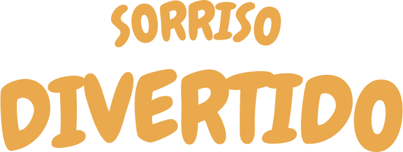

# 🎉 Sorriso Divertido — Site institucional de recreação infantil

Este é o site oficial da **Sorriso Divertido**, uma empresa especializada em recreação infantil para festas, escolas, hotéis, condomínios e eventos em geral. A proposta do site é apresentar os serviços da empresa de forma acessível, alegre e com um forte apelo visual para o público-alvo: pais, responsáveis, gestores escolares e organizadores de eventos.

---

## 🌟 Sobre o projeto

O site foi desenvolvido com o objetivo de **comunicar a missão e os valores da empresa**, **apresentar os serviços oferecidos** e **encantar o visitante com um design lúdico**, leve e visualmente coeso. Também foram incorporadas funcionalidades que simulam o uso real de um site comercial, como botão de WhatsApp, campo de newsletter e responsividade total.

---

## 🛠️ Tecnologias e habilidades utilizadas

- **HTML5**: Estrutura semântica das páginas
- **CSS3**: Estilização com responsividade usando `@media queries`
- **Flexbox & Grid Layout**: Distribuição e organização visual dos componentes
- **Tipografia e paleta personalizada**: Fontes infantis e cores acessíveis
- **Design Mobile-First**: O site se adapta a diversos tamanhos de tela
- **Boas práticas de acessibilidade**: Uso de `alt`, contraste de cores, e navegação clara
- **SEO básico**: Tags `<meta>`, `Open Graph`, `Twitter Card`, etc.
- **Botão flutuante do WhatsApp**: Integração direta com atendimento via chat

---

## 👾 Personagem mascote: Jalelé

O site conta com um mascote próprio, o **Jalelé** — um jacaré sorridente que representa o espírito da empresa. Ele aparece em diversas páginas com ilustrações temáticas que fortalecem a identidade visual da marca.

---

## 🔗 Acesse o site

🌐 [Versão publicada no GitHub Pages](http://sorrisodivertido.com.br/)
